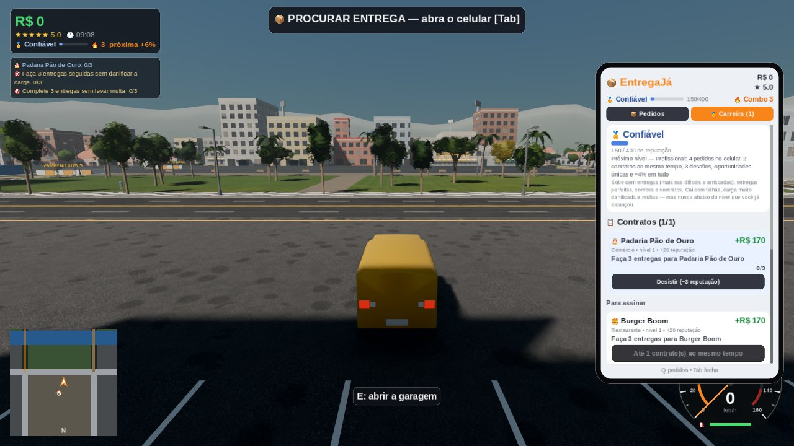
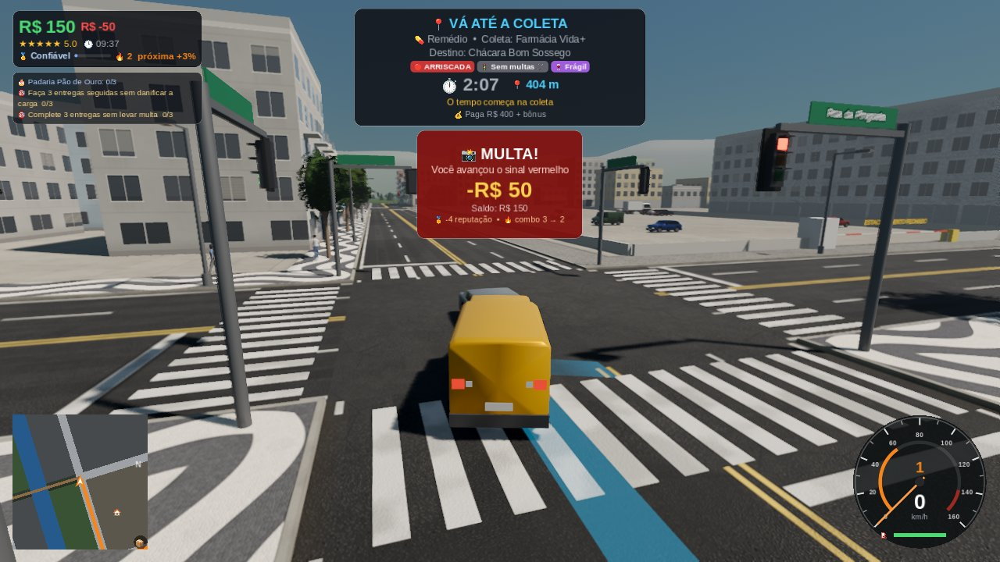

# Entrega Impossível (PC)

Jogo de entregas contra o relógio numa cidade 3D viva, feito em **Godot 4.7** para
Windows e Linux, com o objetivo de ser publicado na **Steam**.

Você trabalha para a **EntregaJá**: aceita pedidos no celular, busca a encomenda,
atravessa a cidade (trânsito, semáforos, chuva, acidentes, atalhos) e entrega dentro do
prazo. Quanto mais rápido e com a carga inteira, mais você ganha. Com o dinheiro, compra
veículos melhores.

| | |
|---|---|
|  |  |
|  |  |
|  |  |
|  |  |

*(Capturas feitas em renderização por software, sem placa de vídeo; num PC real a imagem
fica mais nítida e suave.)*

> **Você não precisa instalar nada para jogar.** Para *editar* o jogo, basta o Godot
> (programa gratuito de ~100 MB, sem cadastro e sem royalties). Unity não é necessário.

---

## Como baixar e jogar

**Windows — link direto:**
https://github.com/thor97349-cell/n-sei/raw/claude/loving-edison-0bukmb/entrega-impossivel-pc/downloads/EntregaImpossivel-windows.zip

1. Clique no link acima: o download do `.zip` começa sozinho (≈38 MB).
2. Abra a pasta **Downloads**, clique com o botão direito no arquivo → **Extrair tudo…** → **Extrair**.
3. Na pasta extraída, dê dois cliques em **EntregaImpossivel.exe**.

(O arquivo fica em `entrega-impossivel-pc/downloads/` neste repositório. Quando o GitHub
Actions estiver funcionando, as versões novas também saem na página **Releases**.)

> O Windows pode mostrar o aviso "O Windows protegeu o computador" (SmartScreen) porque o
> executável não é assinado digitalmente. Clique em **Mais informações → Executar assim mesmo**.
> Para a Steam isso não é necessário.

**Requisitos (estimados):** Windows 10/11 ou Linux 64 bits, placa de vídeo com Vulkan
(qualquer GPU de 2016 para cá; se o Vulkan falhar o jogo tenta OpenGL), 4 GB de RAM.
Há 4 níveis de qualidade gráfica nas Opções.

## Controles

| Ação | Teclado | Controle |
|---|---|---|
| Acelerar / frear | W / S (ou setas) | RT / LT |
| Ré | segure S parado | segure LT parado |
| Virar | A / D | analógico esquerdo |
| Freio de mão | Espaço | A |
| Celular (pedidos) | Tab | Select |
| Aceitar pedido 1/2/3 | 1 / 2 / 3 | clique no botão |
| Abastecer / garagem | E (segure no posto) | X |
| Resgatar veículo / chamar guincho | R | D-pad ↓ |
| Mapa | M | D-pad → |
| Câmera (perseguição / longe / capô) | C | Y |
| Olhar em volta | botão direito do mouse | analógico direito |
| Faróis / buzina | L / H | D-pad ↑ / L3 |
| Pausa | Esc | Start |

## Como o jogo funciona

- **Pedidos**: o celular mostra 3 pedidos (4 a partir de "Profissional") com tipo, nível
  de risco, modificadores, coleta, destino (e região), distância, prazo, pagamento,
  tamanho da carga e, nas viagens longas, quanto combustível vai gastar. Pedidos grandes
  (geladeira) só cabem no caminhão.
- **Coleta e entrega**: pare dentro da vaga amarela "CARGA" iluminada (≈2 s parado).
  O prazo só começa a contar na coleta. O GPS pinta a rota no asfalto e no minimapa.
- **Pagamento** (sempre calculado pelo jogo, nunca pela interface):
  - no prazo: valor cheio, **+35%** se sobrar ≥45% do tempo, **+15%** se sobrar ≥25%;
  - atrasado: até 40 s de tolerância recebe **40%**; depois disso o pedido é cancelado
    e paga **0** — você **nunca perde dinheiro** numa entrega (só as multas da viagem);
  - batidas estragam a carga e reduzem pagamento e nota. Cada tipo aguenta batidas de
    um jeito (o celular mostra: documentos são resistentes, comida é sensível, bolo é
    muito frágil). Durante a entrega o HUD mostra o estado da carga em %, o "−X%" de cada
    batida e quanto a entrega está pagando agora;
  - nota alta (4–5 ★) dá **gorjeta**; mais os bônus dos modificadores, adicional de
    chuva (+15%) e noturno (+10%, das 22h às 5h) e o bônus do combo;
  - o resumo no fim mostra cada parte: entrega, bônus, gorjeta, modificadores, combo,
    multas da viagem e o **total**, e embaixo o combo, a reputação ganha, o progresso do
    contrato e os desafios concluídos (só o que aconteceu).
- **8 tipos de pedido**: pizza, hambúrguer, documentos, remédio, pacote, pacote urgente,
  bolo de festa e geladeira — cada um com prazo, fragilidade e valor diferentes.
- **4 veículos**: furgão Pé-de-Boi (inicial), hatch Faísca, caminhão Brutão e esportivo
  Relâmpago, com física de verdade (curva de torque, câmbio automático, peso, aderência).
- **Cidade**: ~1,5 km², avenidas e rodovia em anel, canal com pontes, uma pinguela estreita
  (atalho arriscado, sem grade), ponte em obras, becos, estacionamento do shopping,
  parque, estádio, obra, chácara fora da cidade; ciclo de dia e noite (1 dia = 24 min).
  Árvores variadas (copa redonda, alta, guarda-chuva, pinheiros, palmeiras e ipês
  floridos), pontos de ônibus, postes de luz que caem quando você bate e lixeiras que
  voam longe. Céu com nuvens que andam com o vento (douradas no fim da tarde, carregadas
  na tempestade, iluminadas de laranja pela cidade à noite), lua e estrelas.
- **Pedestres**: centenas de combinações de roupa (camiseta, manga longa, jaqueta,
  bermuda, saia, vestido), cabelo (curto, comprido, coque, volumoso, boné), tom de pele,
  mochila ou bolsa. Andam pelas calçadas (nunca atravessam a rua), alguns em dupla lado a
  lado; às vezes param para olhar uma vitrine ou o celular; esperam nos pontos de ônibus;
  abrem o guarda-chuva quando chove; pulam para o lado quando você sobe na calçada (ou
  quando vem um carro batido escorregando). Menos gente à noite e na chuva.
- **Trânsito**: 8 modelos (hatch, sedã, SUV, picape, furgão, táxi com luminoso,
  esportivo e caminhão baú). Os carros da IA respeitam semáforos e distância, param para
  você, dão seta antes de virar e, à noite, iluminam o chão com os faróis.
- **Batidas de verdade**: bater num carro do trânsito troca a quantidade de movimento com
  as massas dos dois — a 50 km/h num sedã parado o furgão segue a ~25 km/h e o sedã é
  empurrado uns 7 m, girando se a batida for fora do centro (o caminhão arrasta um hatch;
  o hatch quase não mexe o caminhão). O carro atingido escorrega de lado com atrito de
  pneu, balança a carroceria, liga o pisca-alerta e pode acertar outro carro
  (engavetamento). Encostadas leves só fazem o carro parar com o alerta ligado. Faíscas,
  cacos e poeira nas batidas; fumaça e marcas de pneu (que somem aos poucos) nas freadas
  e derrapagens.
- **Multa do sinal vermelho** (câmera): 25% do seu saldo, entre R$ 15 e R$ 80 — nunca
  deixa o saldo negativo. Uma multa só por cruzamento em cada sinal vermelho, com uma
  pequena tolerância para quem pegou o vermelho em cima da faixa. A tela pisca (flash) e
  mostra o valor descontado e o saldo que sobrou.
- **Eventos**: 🚧 acidente (rua bloqueada; o GPS desvia), 🌧️ tempestade (pista molhada,
  menos aderência, relâmpagos) e 🔓 atalho temporário (ponte em obras ou shopping).
- **Serviços**: posto de gasolina (segure E), guincho quando acaba o combustível (cobra só o
  que você tiver), resgate grátis do carro virado (R), garagem na Central (E).
- **Gasolina**: cada veículo gasta diferente (o caminhão bebe o dobro do furgão). O
  tanque do furgão dura uns 40 km; encher custa ≈ R$ 300. Quando falta, o guincho leva
  ao posto e cobra.
- **Salvamento**: automático a cada 60 s e a cada entrega, com arquivo reserva (.bak).
  Local: `%APPDATA%\EntregaImpossivel\` (Windows) ou `~/.local/share/EntregaImpossivel/` (Linux).
- Idiomas: **português** e **inglês** (automático pelo sistema ou nas Opções).

## Carreira: risco, combo, contratos, desafios e reputação

O ciclo do jogo é **entrega → recompensa → escolha → risco → progressão → nova
oportunidade**. Depois de cada entrega o celular já tem pedidos novos, o combo subiu (ou
caiu), um contrato andou, talvez um desafio pagou — e às vezes aparece uma **entrega
especial**.

**Nível de risco** (cada pedido tem um):

| | Recompensa | Prazo | Rota | Modificadores |
|---|---|---|---|---|
| 🟢 Segura | ×0,8 | folgado (×1,2) | curta | nenhum (às vezes um leve) |
| 🟡 Difícil | ×1,1 | normal | média/longa | 1 |
| 🔴 Arriscada (a partir de "Confiável") | ×1,35 | apertado (×0,92) | longa | 2 |

**Modificadores** (nunca todos juntos; cada um combina só com encomendas que fazem
sentido): ⏱ **Urgente** (prazo 22% menor, +35% se chegar no prazo), 🍷 **Frágil**
(batidas estragam 70% mais, paga +15%), ⛽ **Longa distância** (uma das rotas mais longas
da cidade, paga +12%), 🚦 **Sem multas** (+20% sem nenhuma multa) e ⭐ **Entrega perfeita**
(+25% no prazo, com a carga ≥95% e sem multas). Durante a entrega o HUD mostra as
etiquetas e risca (✖) o bônus que você já perdeu.

**🔥 Combo**: cada entrega no prazo e com a carga acima de 50% soma 1. Bônus sobre a
entrega: combo 2 +3%, 4 +6%, 6 +10%, 10 +15%, 15 +20%. Atraso corta o combo pela metade;
falha, carga muito danificada (<50%) ou cancelar com a carga no carro zeram; multa tira 1.
Combos 3, 5, 8 e 12 dão reputação extra.

**🎯 Desafios**: 2 ativos (3 a partir de "Profissional"), aparecem no canto da tela: N
entregas seguidas sem dano, entrega em menos de X, N entregas sem multa, entrega
econômica (L/km), entregas difíceis, chegar a um combo, entregas perfeitas, entrega à
noite. Pagam na hora (R$ 80–160); um novo entra no lugar depois de 3 entregas.

**📋 Contratos** (aba Carreira do celular, **Q** troca de aba): clientes da cidade —
Pizzaria Bella Napoli, Burger Boom, Padaria Pão de Ouro, Farmácia Vida+, Cartório
Central, Centro de Distribuição, Shopping Centro, Supermercado Preço Bom e o Sr. Valente
(VIP) — oferecem contratos: N entregas, N no prazo, N com a carga intacta, N para uma
região, N perfeitas ou N seguidas no prazo. Assinado, sempre aparece um pedido do cliente
no celular (📋). Concluir paga o contrato (R$ 165 a R$ 1.130) e reputação, e o cliente
passa a oferecer contratos maiores (níveis 1 a 4).

**🚨 Entregas especiais** (raras, ~1 a cada 10–12 entregas, mais frequentes com mais
reputação): 🚨 Entrega especial ("preciso disso antes das 22h"), 👑 Cliente VIP, 🕶 Carga
confidencial ("não abra esta encomenda") e 💰 Oportunidade única. Pagam bem mais,
aparecem no topo do celular e **somem em 2,5 min** se ninguém aceitar.

**🏅 Reputação**:

| Nível | Reputação | Libera |
|---|---|---|
| Novato | 0 | entregas seguras e difíceis, contratos nível 1 |
| Confiável | 120 | entregas arriscadas, a Chácara (zona rural), VIP e carga confidencial, contratos nível 2, +2% em tudo |
| Profissional | 400 | 4 pedidos no celular, 2 contratos, 3 desafios, oportunidades únicas, contratos nível 3, +4% |
| Especialista | 1000 | contratos nível 4, mais especiais, +7% |

Sobe com entregas (×1 seguras, ×1,5 difíceis, ×2,2 arriscadas), perfeitas, combos e
contratos; cai com falhas, carga muito danificada e multas — mas nunca abaixo do nível
já alcançado (você não perde o que liberou). Saves antigos ganham reputação pelas
entregas que já tinham.

**Eventos durante as entregas**: além dos eventos de tempos em tempos, cada entrega tem
uma chance (12% seguras, 28% difíceis, 45% arriscadas) de algo acontecer no caminho: um
**acidente bloqueando um trecho da sua rota**, uma tempestade ou **trânsito pesado**. Às
7h30 e às 17h30 tem **hora do rush**.

**Economia** (simulada com `tools/economy_sim.tscn`, que usa o código de verdade; os
números variam com o jeito de jogar): um jogador médio ganha ≈ R$ 8.500–9.000 por hora
de jogo e compra o Faísca (R$ 10.500) em ≈ 1h20–1h40, o Brutão (R$ 25.000) em ≈ 2h40–3h
e o Relâmpago (R$ 58.000) em ≈ 6h20–6h45. Antes deste update eram ≈ 1h40, 4h e mais de
8h (com os preços antigos de R$ 7.500, 18.000 e 42.000). Os preços subiram porque agora
dá para ganhar mais jogando bem (contratos, combos, desafios, especiais): o primeiro
carro sai mais ou menos no mesmo ritmo e os seguintes um pouco mais rápido. A gasolina
e as multas são os gastos do dia a dia (≈ 2% e 2–4% do que se ganha).

**Para o futuro (história e missões especiais)**: cada cliente tem uma pessoa e falas
(`game/config/clients.gd`), o save guarda o histórico com cada cliente e marcos de
história (`Career.flags`), e o tipo de missão de um pedido é uma classe (`Mission`) —
uma missão diferente (perseguição, fuga, cliente suspeito, missão de história) herda
dela e muda só o que precisa.

## Modo dev (ver o jogo completo)

No menu principal, clique em **🛠 MODO DEV**. Ele usa um **save separado** (o seu jogo
normal não é tocado), já começa com R$ 500.000 e **todos os veículos liberados**.
Durante o jogo, aperte **F1** para abrir o painel (o jogo pausa enquanto ele está aberto):

- **Veículo**: troca na hora para o furgão, hatch, caminhão ou esportivo, no mesmo lugar.
- **Eventos**: acidente, tempestade, atalho da ponte, atalho do shopping, trânsito
  pesado, encerrar evento e ligar/desligar os eventos automáticos.
- **Hora e clima**: 7h, 12h, 18h, 22h e parar/andar o relógio.
- **Dinheiro**: +R$ 10.000, +R$ 100.000 ou zerar (para testar a multa sem saldo).
- **Entrega**: novos pedidos, ir direto para a vaga, carga 100%, tanque cheio, desvirar.
- **Carreira**: +100 de reputação, combo +1, desafios novos, deixar o contrato a uma
  entrega do fim e chamar cada entrega especial (Especial, VIP, Confidencial, Única).
- **Teleporte**: para qualquer local de coleta/entrega ou para a Central.
- **Cidade**: trânsito e pedestres normal/cheio/nenhum, mostrar FPS.

Para sair do modo dev: Esc → Menu principal (volta a usar o seu save normal).

## Como editar o jogo

1. Baixe o **Godot 4.7.2** (versão padrão, não a ".NET"): https://godotengine.org/download
2. Abra o Godot → **Importar** → escolha `entrega-impossivel-pc/project.godot`.
3. Aperte **F5** para jogar dentro do editor.

Onde mexer:

| Quero mudar... | Arquivo |
|---|---|
| Preços, prazos, multas, eventos, relógio, gasolina | `game/config/game_config.gd` |
| Níveis de risco, modificadores, entregas especiais | `game/config/job_rules.gd` |
| Reputação (níveis e o que liberam), combo | `game/config/career_rules.gd` |
| Clientes, contratos e falas (história) | `game/config/clients.gd` |
| Desafios | `game/config/challenges.gd` |
| Tipos de pedido (valor, prazo, fragilidade) | `game/config/order_types.gd` |
| Veículos (potência, peso, câmbio, preço) | `game/config/vehicle_specs.gd` |
| Mapa, locais, ruas, temas dos bairros | `game/world/city_layout.gd` |
| Textos (português/inglês) | `autoload/loc.gd` |
| Chão: asfalto, grama, terra, praça | `game/world/shaders/road.gdshader`, `ground.gdshader` |
| Calçadas (piso de cada bairro) | `game/world/shaders/sidewalk.gdshader` + `SIDEWALK_STYLES` em `city_builder.gd` |
| Fachadas (tijolo, reboco, concreto, janelas) | `game/world/shaders/facade.gdshader` |
| Grama alta, flores, arbustos, cercas vivas | `game/world/ground_cover.gd`, `foliage_kit.gd` |
| Sol, céu, neblina, exposição | `game/world/atmosphere.gd` |
| Nuvens, lua, estrelas (shader do céu) | `game/world/shaders/sky.gdshader` (+ `cloud_noise.png` de `gen_textures.py`) |
| Pedestres: corpo, roupas, cabelos, acessórios | `game/world/pedestrian_mesh.gd`, `shaders/pedestrian.gdshader`, `pedestrian_looks.gd` (pesos) |
| Pedestres: comportamento (duplas, paradas) | `game/world/pedestrians.gd` (`PAIR_CHANCE`, `WANDER_MIN/MAX`) |
| Modelos do trânsito e quanto aparece cada um | `TRAFFIC` em `vehicle_specs.gd`, `PROFILES` em `car_mesh.gd`, `STYLES` em `traffic_car.gd` |
| Batidas (restituição, quando vira destroço) | `game/traffic/traffic_system.gd` (`ram`), `traffic_wreck.gd` (atrito) |
| Faíscas, fumaça e marcas de pneu | `game/vehicle/vehicle_effects.gd` |

Tudo o que se vê é gerado por código (não há modelos 3D nem imagens externas), então
mudar um número já muda o jogo.

### Texturas do chão

As texturas de asfalto, grama, terra, concreto, bloquete, paralelepípedo e pedra
portuguesa (`assets/textures/`) também são geradas por código, pelo script
`tools/gen_textures.py` (Python 3 com `numpy` e `Pillow`). São pequenas (512 px, que se
repetem sem emenda) e os shaders as usam em duas escalas giradas, misturadas por um ruído
grande (`macro_noise.png`), para o chão não ficar com cara de "textura repetida". Para
mudar uma textura: edite o script, rode `python3 tools/gen_textures.py` e abra o projeto
no Godot (ele reimporta sozinho).

### Ferramentas de desenvolvimento

- `tools/preview_models.tscn`, `tools/preview_traffic.tscn`, `tools/preview_city.tscn` —
  tiram prints dos pedestres (inclusive na chuva), dos carros do trânsito (dia e noite)
  e de vistas da cidade em qualquer hora: `godot --path . res://tools/preview_traffic.tscn -- /tmp/t`.

- `tools/economy_sim.tscn` — simula horas de jogo com o código de verdade para três
  perfis de jogador e compara com a economia antiga (dinheiro por hora, tempo até cada
  veículo e nível). Rode depois de mexer em valores:
  `godot --headless --path . res://tools/economy_sim.tscn -- 8`
- `tools/subset_emoji.py` — o jogo embute só os emojis que usa (fonte recortada). Usou um
  emoji novo num texto? Rode `python3 tools/subset_emoji.py` (precisa da fonte Noto Color
  Emoji completa e de `fonttools`).

## Testes automáticos

Rodam sem tela e também no GitHub Actions antes de gerar os executáveis:

```bash
godot --headless --path . res://tests/compile_check.tscn            # todos os scripts compilam
godot --headless --path . res://tests/career_test.tscn              # 59 verificações: pagamento, combo, contratos, desafios, pedidos
godot --headless --fixed-fps 60 --path . res://tests/loop_test.tscn       # 30 entregas seguidas no jogo completo
godot --headless --fixed-fps 120 --path . res://tests/vehicle_test.tscn   # física dos 4 veículos
godot --headless --fixed-fps 120 --path . res://tests/handling_test.tscn  # curvas e batidas
godot --headless --fixed-fps 60 --path . res://tests/gameplay_test.tscn   # 55 verificações do jogo
godot --headless --fixed-fps 60 --path . res://tests/traffic_test.tscn -- 180  # trânsito
godot --headless --fixed-fps 60 --path . res://tests/pedestrian_test.tscn # pedestres
godot --headless --fixed-fps 60 --path . res://tests/crash_test.tscn      # batidas entre carros
```

Resultados atuais (Godot 4.7.2):

| Veículo | 0–100 km/h | Máxima | Frenagem 100–0 | Aderência lateral |
|---|---|---|---|---|
| Pé-de-Boi (furgão) | 10,3 s | 148 km/h | 48 m | 0,99 g |
| Faísca (hatch) | 7,9 s | 183 km/h | 41 m | 1,07 g |
| Brutão (caminhão) | 17,1 s | 108 km/h | 54 m | 0,89 g |
| Relâmpago (esportivo) | 3,4 s | 248 km/h | 36 m | 1,23 g |

Dirigibilidade (teclado, volante todo): nenhum veículo roda nas curvas de 30 a 90 km/h,
meio volante faz meia curva, ao soltar o carro endireita em ~0,2 s; batendo de lado num
muro a 50 km/h o carro não tomba (máx. 10°) e segue andando; derrubar um poste de luz a
50 km/h tira só ~10% da velocidade.

Trânsito (2 min simulados, 36 carros): ~70% em movimento em média, nenhum carro dentro do
outro, nenhum carro da IA avançou o vermelho.

Pedestres (1 min simulado): ~5 mil posições verificadas, nenhuma fora da calçada nem
dentro de prédio/poste/árvore; um carro andando pela calçada a 30 km/h não encosta em
ninguém.

Batidas: furgão a 50 km/h no meio de um sedã parado → o sedã vira destroço, é empurrado
~7 m e fica de pé; o furgão mantém ~47% da velocidade (num muro pararia). A 8 km/h o
carro só para com o pisca-alerta. A 70 km/h o carro atingido escorrega e acerta o de
trás (engavetamento).

## Gerar os executáveis no seu computador

1. No Godot: **Editor → Gerenciar modelos de exportação → Baixar e instalar**.
2. **Projeto → Exportar** → escolha "Windows Desktop" ou "Linux" → **Exportar projeto**.

Ou pela linha de comando:

```bash
godot --headless --path . --export-release "Windows Desktop" build/windows/EntregaImpossivel.exe
godot --headless --path . --export-release "Linux" build/linux/EntregaImpossivel.x86_64
```

O `.exe` sai em arquivo único (o jogo vai embutido).

## Publicar na Steam — passo a passo

Os valores e regras abaixo são os da Steam no momento em que este guia foi escrito;
confira em https://partner.steamgames.com antes de pagar qualquer coisa.

1. **Conta de desenvolvedor**: crie a conta no Steamworks (partner.steamgames.com),
   aceite o contrato de distribuição, informe dados bancários e o formulário de impostos
   (para brasileiros, geralmente o **W-8BEN**) e faça a verificação de identidade.
2. **Taxa do Steam Direct**: **US$ 100 por jogo**. Ela volta para você depois que o jogo
   fatura US$ 1.000 brutos.
3. **Crie o app** no painel: você recebe um **App ID** e um **Depot ID**.
4. **Página da loja** (em português e inglês): descrição curta e longa, no mínimo 5
   capturas de tela 1920×1080 (use as Opções no Ultra), trailer (recomendado), requisitos
   de sistema, classificação de conteúdo (questionário), preço e as **artes de cápsula**
   nos tamanhos que o painel pedir (cabeçalho, cápsulas pequena/principal/vertical,
   biblioteca, fundo e logo).
5. **"Em breve"**: a página precisa ficar pública como "Em breve" por pelo menos 2 semanas
   antes do lançamento, e há um prazo mínimo entre pagar a taxa e lançar. Use esse tempo
   para juntar lista de desejos.
6. **Enviar o jogo (SteamPipe)**: baixe o **Steamworks SDK**, coloque o `.exe` exportado
   na pasta `content` do depot, configure o arquivo de build (`app_build_<AppID>.vdf`) e
   envie com o `steamcmd`. Em **Instalação → Geral**, defina a opção de inicialização
   `EntregaImpossivel.exe`. (Para Linux, crie um segundo depot com o `.x86_64`.)
7. **Nuvem Steam (opcional, sem código)**: em *Steam Cloud → Auto-Cloud*, aponte para
   `%APPDATA%\EntregaImpossivel\` com os arquivos `save.json*` e `settings.cfg`.
8. **Revisão**: envie a página e o build para revisão da Valve (alguns dias úteis).
9. **Lançar**: com tudo aprovado, clique em lançar.

Conquistas, estatísticas e overlay da Steam exigem integrar o SDK ao jogo (no Godot,
com a extensão gratuita **GodotSteam**). Isso **ainda não foi feito**.

## O que ainda falta / limitações (honestamente)

- **Visual**: prédios, carros e objetos são gerados por código (formas + shaders), com
  texturas de chão também geradas por código. Fica coerente e bem acabado, mas não é
  fotorrealista. Para vender bem na Steam, o próximo passo é
  trocar por modelos 3D e texturas de verdade (há pacotes gratuitos CC0, como Kenney e
  Poly Haven — os sites estavam bloqueados neste ambiente, por isso não foram usados).
- Pedestres só andam nas calçadas (ainda não atravessam na faixa); os carros da IA não
  trocam de faixa nem ultrapassam, e nos cruzamentos com 4 saídas só seguem reto ou viram
  à direita (para nunca se cruzarem).
- **Windows**: o `.exe` é gerado com os modelos oficiais do Godot, mas foi testado em
  execução só no Linux (o ambiente de desenvolvimento não tem Windows). Teste antes de
  publicar.
- **Desempenho** não foi medido em placas de vídeo reais — só em renderização por
  software. A parte de lógica (física a 120 Hz, trânsito com 30 carros, pedestres,
  entregas, HUD) custa ~6 ms de CPU por quadro. Use os níveis de qualidade nas Opções se ficar pesado.
- Sem integração com Steam (conquistas/overlay), sem multiplayer, sem trilha sonora.
- O modo "capô" substitui a visão de dentro do carro (não há interior modelado).

## Créditos

Veja [CREDITS.md](CREDITS.md). Motor Godot (MIT); fontes Liberation Sans e Noto Color
Emoji (SIL OFL 1.1). Todo o resto foi gerado por código neste projeto.
