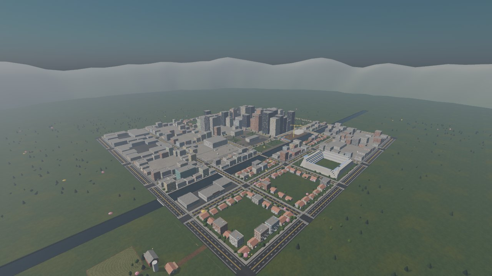
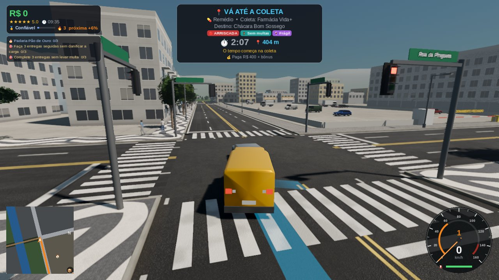
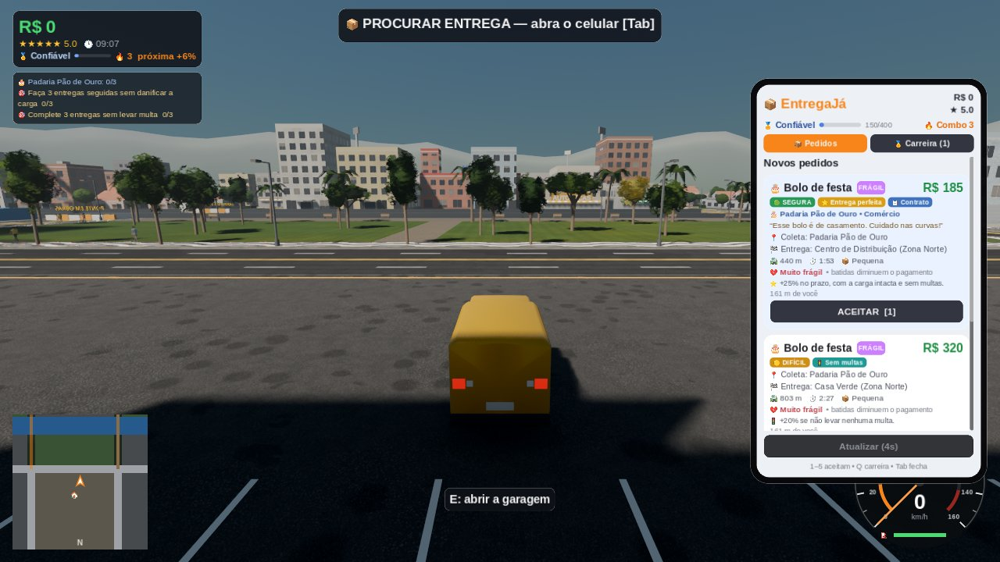
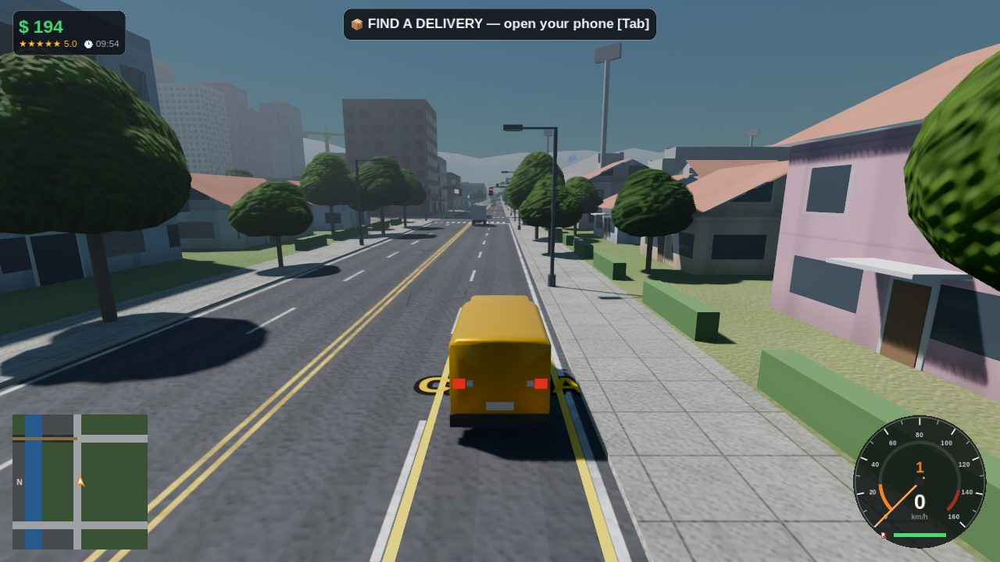
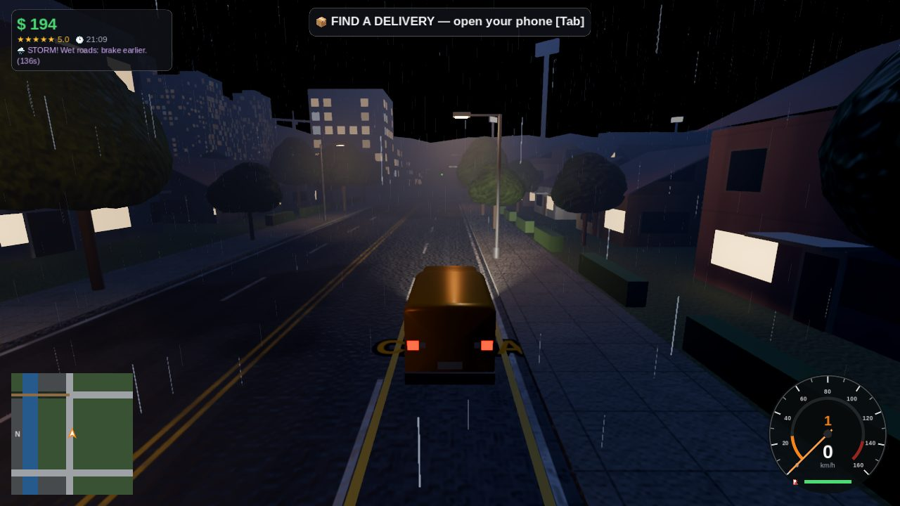
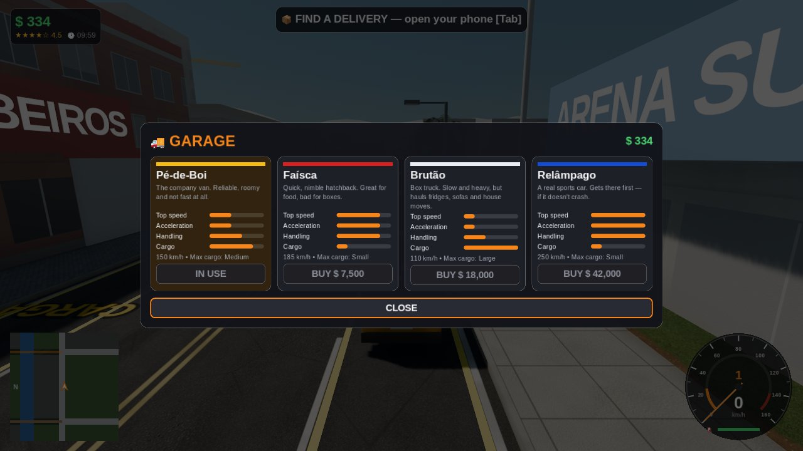

# Entrega Impossível (PC)

Jogo de entregas contra o relógio numa cidade 3D viva, feito em **Godot 4.7** para
Windows e Linux, com o objetivo de ser publicado na **Steam**.

Você trabalha para a **EntregaJá**: aceita pedidos no celular, busca a encomenda,
atravessa a cidade (trânsito, semáforos, chuva, acidentes, atalhos) e entrega dentro do
prazo. Quanto mais rápido e com a carga inteira, mais você ganha. Com o dinheiro, compra
veículos melhores.

| | |
|---|---|
|  |  |
|  |  |
|  |  |

*(Capturas feitas em renderização por software, sem placa de vídeo; num PC real a imagem
fica mais nítida e suave.)*

> **Você não precisa instalar nada para jogar.** Para *editar* o jogo, basta o Godot
> (programa gratuito de ~100 MB, sem cadastro e sem royalties). Unity não é necessário.

---

## Como baixar e jogar

Os executáveis são gerados automaticamente pelo GitHub a cada atualização do jogo e
publicados na página de **Releases** do repositório (link público, sem login):

1. Abra https://github.com/thor97349-cell/n-sei/releases/tag/entrega-latest
2. Baixe `EntregaImpossivel-windows.zip` (ou `EntregaImpossivel-linux.zip`).
3. Descompacte e abra `EntregaImpossivel.exe` (Windows) ou `EntregaImpossivel.x86_64` (Linux).

Para uma versão fixa (ex.: para mandar para amigos testarem), crie uma tag `entrega-v0.1.0`:
o mesmo processo publica uma Release com esse nome.

> O Windows pode mostrar o aviso "O Windows protegeu o computador" (SmartScreen) porque o
> executável não é assinado digitalmente. Clique em **Mais informações → Executar assim mesmo**.
> Para a Steam isso não é necessário.

**Requisitos (estimados):** Windows 10/11 ou Linux 64 bits, placa de vídeo com Vulkan
(qualquer GPU de 2016 para cá; se o Vulkan falhar o jogo tenta OpenGL), 4 GB de RAM.
Há 4 níveis de qualidade gráfica nas Opções.

## Controles

| Ação | Teclado | Controle |
|---|---|---|
| Acelerar / frear | W / S (ou setas) | RT / LT |
| Ré | segure S parado | segure LT parado |
| Virar | A / D | analógico esquerdo |
| Freio de mão | Espaço | A |
| Celular (pedidos) | Tab | Select |
| Aceitar pedido 1/2/3 | 1 / 2 / 3 | clique no botão |
| Abastecer / garagem | E (segure no posto) | X |
| Resgatar veículo / chamar guincho | R | D-pad ↓ |
| Mapa | M | D-pad → |
| Câmera (perseguição / longe / capô) | C | Y |
| Olhar em volta | botão direito do mouse | analógico direito |
| Faróis / buzina | L / H | D-pad ↑ / L3 |
| Pausa | Esc | Start |

## Como o jogo funciona

- **Pedidos**: o celular mostra 3 pedidos com tipo, coleta, destino, distância da rota,
  prazo, pagamento e tamanho da carga. Pedidos grandes (geladeira) só cabem no caminhão.
- **Coleta e entrega**: pare dentro da vaga amarela "CARGA" iluminada (≈2 s parado).
  O prazo só começa a contar na coleta. O GPS pinta a rota no asfalto e no minimapa.
- **Pagamento** (sempre calculado pelo jogo, nunca pela interface):
  - no prazo: valor cheio, **+35%** se sobrar ≥45% do tempo, **+15%** se sobrar ≥25%;
  - atrasado: até 40 s de tolerância recebe **40%**; depois disso o pedido é cancelado
    e paga **0** — você **nunca perde dinheiro** numa entrega;
  - batidas estragam a carga (bolo e pizza são frágeis) e reduzem pagamento e nota;
  - nota alta (4–5 ★) dá **gorjeta**.
- **8 tipos de pedido**: pizza, hambúrguer, documentos, remédio, pacote, pacote urgente,
  bolo de festa e geladeira — cada um com prazo, fragilidade e valor diferentes.
- **4 veículos**: furgão Pé-de-Boi (inicial), hatch Faísca, caminhão Brutão e esportivo
  Relâmpago, com física de verdade (curva de torque, câmbio automático, peso, aderência).
- **Cidade**: ~1,5 km², avenidas e rodovia em anel, canal com pontes, uma pinguela estreita
  (atalho arriscado, sem grade), ponte em obras, becos, estacionamento do shopping,
  parque, estádio, obra, chácara fora da cidade; ciclo de dia e noite (1 dia = 24 min).
- **Trânsito**: carros da IA respeitam semáforos e distância e param para você.
  Avançar o sinal vermelho gera **multa** (câmera).
- **Eventos**: 🚧 acidente (rua bloqueada; o GPS desvia), 🌧️ tempestade (pista molhada,
  menos aderência, relâmpagos) e 🔓 atalho temporário (ponte em obras ou shopping).
- **Serviços**: posto de gasolina (segure E), guincho quando acaba o combustível (cobra só o
  que você tiver), resgate grátis do carro virado (R), garagem na Central (E).
- **Salvamento**: automático a cada 60 s e a cada entrega, com arquivo reserva (.bak).
  Local: `%APPDATA%\EntregaImpossivel\` (Windows) ou `~/.local/share/EntregaImpossivel/` (Linux).
- Idiomas: **português** e **inglês** (automático pelo sistema ou nas Opções).

## Como editar o jogo

1. Baixe o **Godot 4.7.2** (versão padrão, não a ".NET"): https://godotengine.org/download
2. Abra o Godot → **Importar** → escolha `entrega-impossivel-pc/project.godot`.
3. Aperte **F5** para jogar dentro do editor.

Onde mexer:

| Quero mudar... | Arquivo |
|---|---|
| Preços, prazos, multas, eventos, relógio | `game/config/game_config.gd` |
| Tipos de pedido (valor, prazo, fragilidade) | `game/config/order_types.gd` |
| Veículos (potência, peso, câmbio, preço) | `game/config/vehicle_specs.gd` |
| Mapa, locais, ruas, temas dos bairros | `game/world/city_layout.gd` |
| Textos (português/inglês) | `autoload/loc.gd` |

Tudo o que se vê é gerado por código (não há modelos 3D nem imagens externas), então
mudar um número já muda o jogo.

## Testes automáticos

Rodam sem tela e também no GitHub Actions antes de gerar os executáveis:

```bash
godot --headless --path . res://tests/compile_check.tscn            # todos os scripts compilam
godot --headless --fixed-fps 120 --path . res://tests/vehicle_test.tscn   # física dos 4 veículos
godot --headless --fixed-fps 60 --path . res://tests/gameplay_test.tscn   # 41 verificações do jogo
godot --headless --fixed-fps 60 --path . res://tests/traffic_test.tscn -- 180  # trânsito
```

Resultados atuais (Godot 4.7.2):

| Veículo | 0–100 km/h | Máxima | Frenagem 100–0 | Aderência lateral |
|---|---|---|---|---|
| Pé-de-Boi (furgão) | 10,3 s | 148 km/h | 48 m | 0,94 g |
| Faísca (hatch) | 7,9 s | 183 km/h | 41 m | 1,03 g |
| Brutão (caminhão) | 17,1 s | 108 km/h | 54 m | 0,84 g |
| Relâmpago (esportivo) | 3,4 s | 248 km/h | 36 m | 1,16 g |

Trânsito (4 min simulados, 36 carros): 70% em movimento em média, nenhum carro dentro do
outro, nenhum carro da IA avançou o vermelho.

## Gerar os executáveis no seu computador

1. No Godot: **Editor → Gerenciar modelos de exportação → Baixar e instalar**.
2. **Projeto → Exportar** → escolha "Windows Desktop" ou "Linux" → **Exportar projeto**.

Ou pela linha de comando:

```bash
godot --headless --path . --export-release "Windows Desktop" build/windows/EntregaImpossivel.exe
godot --headless --path . --export-release "Linux" build/linux/EntregaImpossivel.x86_64
```

O `.exe` sai em arquivo único (o jogo vai embutido).

## Publicar na Steam — passo a passo

Os valores e regras abaixo são os da Steam no momento em que este guia foi escrito;
confira em https://partner.steamgames.com antes de pagar qualquer coisa.

1. **Conta de desenvolvedor**: crie a conta no Steamworks (partner.steamgames.com),
   aceite o contrato de distribuição, informe dados bancários e o formulário de impostos
   (para brasileiros, geralmente o **W-8BEN**) e faça a verificação de identidade.
2. **Taxa do Steam Direct**: **US$ 100 por jogo**. Ela volta para você depois que o jogo
   fatura US$ 1.000 brutos.
3. **Crie o app** no painel: você recebe um **App ID** e um **Depot ID**.
4. **Página da loja** (em português e inglês): descrição curta e longa, no mínimo 5
   capturas de tela 1920×1080 (use as Opções no Ultra), trailer (recomendado), requisitos
   de sistema, classificação de conteúdo (questionário), preço e as **artes de cápsula**
   nos tamanhos que o painel pedir (cabeçalho, cápsulas pequena/principal/vertical,
   biblioteca, fundo e logo).
5. **"Em breve"**: a página precisa ficar pública como "Em breve" por pelo menos 2 semanas
   antes do lançamento, e há um prazo mínimo entre pagar a taxa e lançar. Use esse tempo
   para juntar lista de desejos.
6. **Enviar o jogo (SteamPipe)**: baixe o **Steamworks SDK**, coloque o `.exe` exportado
   na pasta `content` do depot, configure o arquivo de build (`app_build_<AppID>.vdf`) e
   envie com o `steamcmd`. Em **Instalação → Geral**, defina a opção de inicialização
   `EntregaImpossivel.exe`. (Para Linux, crie um segundo depot com o `.x86_64`.)
7. **Nuvem Steam (opcional, sem código)**: em *Steam Cloud → Auto-Cloud*, aponte para
   `%APPDATA%\EntregaImpossivel\` com os arquivos `save.json*` e `settings.cfg`.
8. **Revisão**: envie a página e o build para revisão da Valve (alguns dias úteis).
9. **Lançar**: com tudo aprovado, clique em lançar.

Conquistas, estatísticas e overlay da Steam exigem integrar o SDK ao jogo (no Godot,
com a extensão gratuita **GodotSteam**). Isso **ainda não foi feito**.

## O que ainda falta / limitações (honestamente)

- **Visual**: prédios, carros e objetos são gerados por código (formas + shaders). Fica
  coerente e limpo, mas não é fotorrealista. Para vender bem na Steam, o próximo passo é
  trocar por modelos 3D e texturas de verdade (há pacotes gratuitos CC0, como Kenney e
  Poly Haven — os sites estavam bloqueados neste ambiente, por isso não foram usados).
- **Sem pedestres**; os carros da IA não trocam de faixa nem ultrapassam, e nos cruzamentos
  com 4 saídas só seguem reto ou viram à direita (para nunca se cruzarem).
- **Windows**: o `.exe` é gerado com os modelos oficiais do Godot, mas foi testado em
  execução só no Linux (o ambiente de desenvolvimento não tem Windows). Teste antes de
  publicar.
- **Desempenho** não foi medido em placas de vídeo reais — só em renderização por
  software. A parte de lógica (física a 120 Hz, trânsito com 30 carros, entregas, HUD)
  custa ~7 ms de CPU por quadro. Use os níveis de qualidade nas Opções se ficar pesado.
- Sem integração com Steam (conquistas/overlay), sem multiplayer, sem trilha sonora.
- O modo "capô" substitui a visão de dentro do carro (não há interior modelado).

## Créditos

Veja [CREDITS.md](CREDITS.md). Motor Godot (MIT); fontes Liberation Sans e Noto Color
Emoji (SIL OFL 1.1). Todo o resto foi gerado por código neste projeto.
