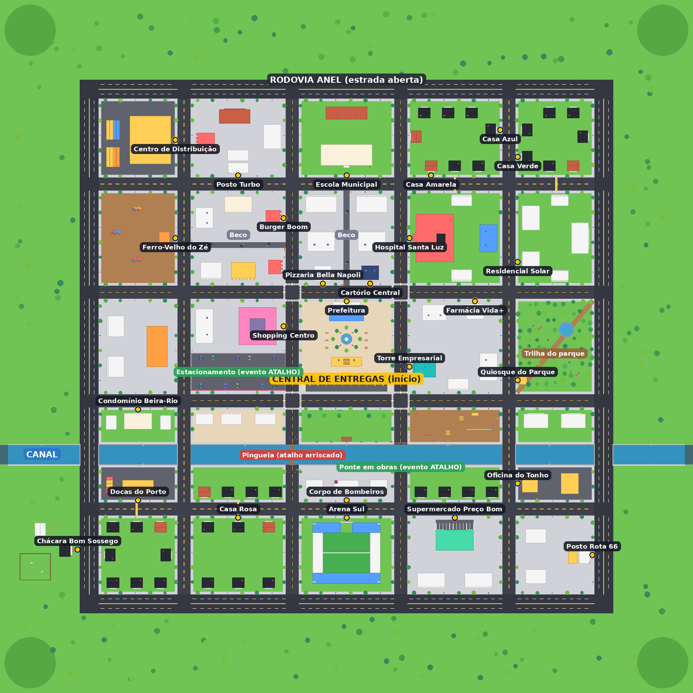

# 📦 ENTREGA IMPOSSÍVEL — protótipo para Roblox

Jogo multiplayer de entregas caóticas: você recebe pedidos, pega a encomenda, dirige
pela cidade contra o relógio e escolhe entre o **caminho seguro e longo** ou o
**atalho arriscado e rápido**.



---

## ⚡ Começo rápido (5 minutos)

1. **Baixe o arquivo do jogo:**
   [`build/EntregaImpossivel.rbxl`](https://github.com/thor97349-cell/n-sei/raw/claude/loving-edison-0bukmb/entrega-impossivel/build/EntregaImpossivel.rbxl)
   (no GitHub: pasta `entrega-impossivel/build` → arquivo → botão **Download raw file**).
2. Abra o **Roblox Studio** → **File → Open from File…** → escolha `EntregaImpossivel.rbxl`.
   A cidade já aparece pronta na tela.
3. Clique em **Play** (ou aperte **F5**).
4. O painel **📦 NOVAS ENTREGAS** abre sozinho. Aperte **1**, **2** ou **3** (ou clique em
   ACEITAR).
5. Ande até o seu furgão amarelo no estacionamento da Central de Entregas e aperte **E**
   (**Dirigir**). Siga a **seta** acima do carro e a **coluna de luz** até a coleta, depois
   até o destino.

> Nada precisa ser criado à mão: todos os scripts, pastas, RemoteEvents e o mapa já estão
> dentro do arquivo. As únicas etapas manuais são as de **publicação/salvamento** abaixo.

### 🎮 Controles

| Ação | PC | Celular | Controle |
|---|---|---|---|
| Acelerar / frear / ré | W / S (ou ↑ ↓) | analógico | gatilhos / analógico |
| Virar | A / D (ou ← →) | analógico | analógico |
| Freio de mão (derrapar) | Shift | — | B |
| Entrar no veículo | E (perto da porta) | botão na tela | X |
| Sair do veículo | Espaço | botão de pular | A |
| Resgatar veículo (virou/caiu) | R ou botão 🔄 | botão 🔄 | — |
| Chamar veículo até você | botão 🚗 | botão 🚗 | — |
| Abrir/fechar pedidos | G ou botão 📦 | botão 📦 | Y |
| Aceitar pedido 1 / 2 / 3 | 1 / 2 / 3 | tocar em ACEITAR | ← ↑ → |

---

## 🛠️ Passos manuais no Roblox Studio (salvamento de dinheiro)

O **DataStore** (salvar dinheiro) só funciona em jogos **publicados**. Enquanto o jogo não
for publicado, ele roda normalmente, mas mostra um aviso amarelo no canto da tela:
*“o dinheiro NÃO está sendo salvo”*. Para ativar o salvamento:

1. No Studio, com o arquivo aberto: **File → Publish to Roblox** → **Create new experience**
   → dê um nome (ex.: *Entrega Impossível*) → **Create**.
2. Aba **Home → Game Settings → Security** → ligue **Enable Studio Access to API Services**
   → **Save**.
3. Clique em **Play**, faça uma entrega, pare o teste (**Stop**) e dê **Play** de novo:
   o dinheiro continua lá. O aviso amarelo some.
4. (Recomendado) **Game Settings → Places → ⋯ → Configure** → **Max Players** entre 8 e 16.
5. Para outras pessoas jogarem: **Game Settings → Permissions → Public**.

### Testar com vários jogadores ao mesmo tempo

Aba **Test** → em **Clients and Servers**, escolha **2 Players** (ou mais) → **Start**.
Abre uma janela para cada jogador: cada um tem o próprio dinheiro, pedido, timer e
destino, e só consegue dirigir o próprio furgão.

### Testar os eventos sem esperar

No Studio aparece um botão **🛠️** no canto superior direito (só no Studio — em servidores
publicados ele não existe e o servidor ignora esses comandos). Ele força **Acidente**,
**Tempestade** e **Atalho**, encerra o evento atual e dá **+$1000** para testes. No Studio
os eventos também acontecem sozinhos mais cedo (~30 s), para facilitar.

---

## 1. Sistemas criados

| Sistema | O que faz |
|---|---|
| **Mapa (MapBuilder + MapLayout)** | Cidade de ~1 km × 1 km (2.000 × 2.000 studs) gerada a partir de dados: 26 locais de coleta/entrega, grade de avenidas, rodovia em anel (estrada aberta e rápida), canal com pontes, pinguela estreita sem grade (atalho arriscado), 2 becos, trilha esburacada no parque, obra com barris, lombadas, praça central com fonte, estádio, hospital, 2 postos de gasolina, lojas, área residencial, fazenda fora da cidade. |
| **Pedidos (DeliveryService + DeliveryRules)** | 3 ofertas por vez, 6 tipos de encomenda com recompensa e prazo diferentes. Coleta e entrega são detectadas **pelo servidor**. Prazo e recompensa calculados pela distância da rota segura (grafo de ruas). |
| **Tempo e bônus** | O timer começa na coleta. ⚡ Relâmpago (+35%) se sobrar ≥45% do tempo, 🚀 Rápido (+15%) se sobrar ≥25%. Se o tempo acabar: ❌ ENTREGA ATRASADA — ainda dá para entregar por 40% durante 30 s; depois o pedido é cancelado **sem perder dinheiro**. |
| **Dinheiro (EconomyService)** | Moeda **$**, visível no HUD e no placar do Roblox. Só o servidor altera o dinheiro. Já tem `SpendMoney`/`CanAfford` prontos para a futura loja. |
| **Salvamento (DataService)** | DataStore com várias tentativas, trava de sessão entre servidores, salvamento ao sair, a cada 90 s e ao desligar o servidor; nunca grava dados inválidos nem sobrescreve o save quando o carregamento falha. Estrutura já preparada para veículos, upgrades e personalização. |
| **Veículo (VehicleService + VehicleBuilder + VehicleController)** | Furgão “Pé-de-Boi” com física arcade (acelera, freia, ré, curva, freio de mão com derrapagem, não capota). Cada jogador tem o seu; só o dono dirige. Botões para chamar o veículo e para resgatá-lo. Novos veículos = nova entrada no `VehicleConfig`. |
| **Eventos aleatórios (EventService)** | 🚧 **Acidente** (bloqueia uma rua), 🌧️ **Tempestade** (chuva, neblina, pista escorregadia), 🔓 **Atalho** (abre a ponte da obra ou o estacionamento do shopping). Um evento a cada ~3–5 min. Arquitetura pronta para eventos que afetam todos (tornado, terremoto...). |
| **Trânsito (TrafficController)** | 18 carros circulando em 5 circuitos (centro mais movimentado, rodovia mais livre). Freiam quando há alguém na frente. |
| **Interface (HUD, painel de pedidos, notificações, minimapa, marcadores)** | 💰 dinheiro, 📦 pedido atual, 📍 destino, ⏱️ tempo (vermelho e pulsando no fim), 🛣️ distância, status no topo, resultado animado com bônus, minimapa com ruas/canal/atalhos/acidentes, seta 3D sobre o carro, coluna de luz no objetivo, velocímetro. Adapta-se a PC e celular. |
| **Obstáculos (ObstacleService)** | Barris e cones derrubáveis que voltam sozinhos para o lugar quando ninguém está perto. |

## 2. Objetos, pastas e scripts criados — e onde ficam

Tudo abaixo já está dentro de `EntregaImpossivel.rbxl` (no **Explorer** do Studio):

```
ServerScriptService
└─ Server
   ├─ Main                     (Script)  liga todos os serviços na ordem certa
   ├─ Services
   │  ├─ MapService            garante mapa, pastas e iluminação
   │  ├─ DataService           salvar/carregar (DataStore)
   │  ├─ EconomyService        dinheiro + placar
   │  ├─ DeliveryService       pedidos, coleta, entrega, timer, pagamento
   │  ├─ VehicleService        criar/estacionar/resgatar veículos
   │  ├─ EventService          sorteio e controle dos eventos
   │  ├─ ObstacleService       barris/cones voltam ao lugar
   │  ├─ NotificationService   avisos na tela
   │  └─ DebugService          comandos de teste (só no Studio)
   ├─ Events                   Accident · Storm · Shortcut
   ├─ Vehicles/VehicleBuilder  monta o modelo do veículo
   └─ Map/MapBuilder           constrói a cidade a partir do MapLayout

ReplicatedStorage
├─ Remotes                     (criada pelo servidor ao iniciar: 10 RemoteEvents)
└─ Shared
   ├─ Config
   │  ├─ GameConfig            tempos, raios, bônus, salvamento
   │  ├─ OrderConfig           tipos de encomenda (🍕 🍔 📄 💊 📦 ⚡📦)
   │  ├─ VehicleConfig         veículos e dirigibilidade
   │  ├─ EventConfig           frequência/duração dos eventos
   │  └─ TrafficConfig         circuitos do trânsito
   ├─ Map/MapLayout            planta da cidade e os 26 locais
   ├─ Map/RoadNetwork          grafo das ruas (rotas e “ponto de rua mais próximo”)
   ├─ DeliveryRules            cálculo de ofertas, prazo e pagamento
   └─ Util                     Format · Remotes · RateLimiter · Signal

StarterPlayer/StarterPlayerScripts
└─ Client
   ├─ Main                     (LocalScript) liga os controladores
   ├─ Controllers              HUD · OrderBoard · Notification · Marker · Minimap ·
   │                           Vehicle · Weather · Traffic · Sound · Debug · DeliveryClient
   └─ UI                       Theme (cores/fontes) · UIUtil

ServerStorage/VehicleTemplates   (vazia) para modelos de veículos feitos à mão no futuro

Workspace
├─ Map        Ground · Roads · Blocks · Buildings · Locations · Props · Nature ·
│             Obstacles · Shortcuts · Boundaries · SpawnLocation
├─ Vehicles       (criada ao jogar) veículos dos jogadores
├─ WorldEvents    (criada ao jogar) objetos dos eventos (ex.: acidente)
└─ LocalEffects   (só no cliente) seta, coluna de luz, trânsito, chuva

Lighting: Atmosphere · Bloom · ColorCorrection · SunRays (visual colorido, tecnologia Future)
```

No repositório, o código-fonte está em `entrega-impossivel/src/` com a mesma estrutura.

### Onde mudar as coisas mais comuns

| Quero mudar… | Arquivo |
|---|---|
| Recompensa/prazo de cada tipo de pedido | `ReplicatedStorage.Shared.Config.OrderConfig` |
| Bônus, tolerância de atraso, raio de entrega | `ReplicatedStorage.Shared.Config.GameConfig` |
| Velocidade, curva e aderência do carro | `ReplicatedStorage.Shared.Config.VehicleConfig` |
| Frequência e duração dos eventos | `ReplicatedStorage.Shared.Config.EventConfig` |
| Quantidade de carros no trânsito | `ReplicatedStorage.Shared.Config.TrafficConfig` |
| Locais, prédios, ruas | `ReplicatedStorage.Shared.Map.MapLayout` (veja “Mudar o mapa” abaixo) |

## 3. Como testar no Roblox Studio

Siga o **Começo rápido** e os **Passos manuais** acima. Roteiro sugerido (confere os 15
pontos do protótipo):

1. **Play** → você nasce na Central de Entregas (praça central). *(1, 2)*
2. O furgão amarelo com o seu nome está no estacionamento. *(3)*
3. O painel de pedidos abre sozinho com 3 ofertas; aceite uma. *(4, 5)*
4. Siga a seta/coluna amarela até a coleta. Ao chegar, toca um som e o cartão muda para
   **📦 ENTREGA ATIVA** com o timer rodando; o objetivo fica verde. *(6, 7, 8, 10)*
5. Dirija até o destino (tente a pinguela ou os becos!). *(9)*
6. Ao chegar: **✅ ENTREGA CONCLUÍDA! + $…**, com bônus se foi rápido. O dinheiro sobe no
   canto e no placar. *(11, 12, 13)*
7. Depois de 4 s o painel abre de novo com novas ofertas. *(15)*
8. Com o jogo publicado e as APIs ligadas, pare e rode de novo: o dinheiro continua. *(14)*
9. Teste também: deixar o tempo acabar (❌ ENTREGA ATRASADA), cair no canal e apertar **R**,
   forçar eventos pelo botão 🛠️, e jogar com 2 jogadores.

## 4. O que está funcionando

**Verificado automaticamente neste ambiente** (sem o Studio):

- **Tipagem de todos os 41 scripts** contra as definições oficiais da API do Roblox
  (luau-lsp, modo estrito): nenhum erro — nomes de propriedades, tipos e chamadas conferem.
- **65 testes automatizados** (`tools/tests`), incluindo:
  - planta da cidade: nenhum prédio sobreposto, todos os pontos de entrega na beira da rua;
  - rotas: a pinguela e a ponte em obras ficam fora da “rota segura” (por isso são atalhos);
    todo prazo é alcançável com o carro inicial;
  - o construtor de mapa roda e gera **4.191 partes**; atalhos abrem e fecham;
  - o veículo é montado com todas as peças e física;
  - **ciclo completo de entrega com 3 jogadores simulados**: pagamento acontece **uma única
    vez**, teleporte direto ao destino não vale, um jogador não completa o pedido do outro,
    atraso paga 40%, prazo esgotado não tira dinheiro, cancelar e pedir novas ofertas
    respeitam o intervalo, jogador que sai é removido;
  - **salvamento**: jogador novo, carregar/salvar, falhas temporárias do Roblox, falha
    permanente (desconecta **sem sobrescrever** o save), trava entre servidores, dados
    corrompidos, dinheiro inválido nunca é gravado, salvamento ao desligar e modo Studio
    sem API;
  - eventos: tempestade, acidente (não nasce em cima de jogadores) e atalho.

**Precisa ser conferido por você no Studio** (não há como rodar a física e a tela do
Roblox aqui):

- a **sensação de dirigir** — todos os números ficam em `VehicleConfig` para ajuste fino;
- a aparência da interface em telas diferentes (PC/celular);
- a chuva e o trânsito na prática (colisões com os carros do trânsito);
- os **sons** usam arquivos que vêm com o Roblox (`rbxasset://sounds/...`); se algum não
  existir na sua versão, o jogo segue sem aquele som. Troque em
  `Client/Controllers/SoundController` por sons da Creator Store se quiser.

## 5. O que ainda NÃO foi implementado (de propósito)

Conforme pedido, ficaram de fora: pets, trading, armas, clãs, battle pass, códigos,
gamepasses, loja de Robux, níveis complexos, casas, polícia, NPCs complexos, garagem/loja
de veículos, upgrades e personalização (só a **estrutura de dados** já existe). Também não
há música, semáforos, pedestres, nem ranking entre jogadores.

## 6. Próximos 5 passos recomendados

1. **Jogar e calibrar** com pessoas reais: ajustar `VehicleConfig` (sensação do carro) e
   `OrderConfig` (prazos/recompensas); adicionar eventos de funil do `AnalyticsService`
   (aceitou → coletou → entregou) para ver onde os jogadores desistem.
2. **Garagem com um 2º veículo** (ex.: moto — mais rápida, derrapa mais), comprada com $.
   O `DataService` já guarda `Vehicles.Owned/Equipped` e o `EconomyService` já tem
   `SpendMoney`; basta uma tela de compra e uma entrada nova no `VehicleConfig`.
3. **Motivo para voltar amanhã**: sequência de entregas no prazo (combo com multiplicador),
   placar semanal de entregas (OrderedDataStore) e uma meta diária simples.
4. **Crescer a cidade com propósito**: um bairro novo (porto/aeroporto) com mais atalhos,
   semáforos e pedestres simples — tudo pelo `MapLayout`.
5. **Eventos grandes e polimento**: ponte destruída/tornado usando o `EventService`, música
   e sons de motor, ícone e thumbnails, e então publicar e divulgar.

---

## Para quem for programar

- O código fica em `src/` e é sincronizado/compilado com **[Rojo](https://rojo.space)**
  (`default.project.json`). Ferramentas listadas em `rokit.toml`.
- `./tools/build.sh` — gera `build/EntregaImpossivel.rbxl` (Rojo → testes → mapa “assado”
  pelo [Lune](https://lune-org.github.io), rodando o mesmo `MapBuilder` do jogo).
- `./tools/check.sh` — verificação de tipos com a API do Roblox + formatação (StyLua).
- Desenvolvimento ao vivo: `rojo serve` + plugin do Rojo no Studio. Se `workspace.Map` não
  existir, o servidor constrói a cidade sozinho ao iniciar.

### Mudar o mapa

`MapLayout` descreve a cidade em dados. Para um local novo, adicione uma entrada em
`Locations` (posição do ponto de entrega, para onde a fachada aponta e o estilo do prédio)
e rode `./tools/build.sh` — os testes avisam se algo ficou sobreposto ou longe da rua.
Editou o mapa direto no Studio? Tudo bem: o jogo usa o `workspace.Map` que estiver no
arquivo (só não rode o build de novo por cima, senão ele gera o mapa do `MapLayout`).
